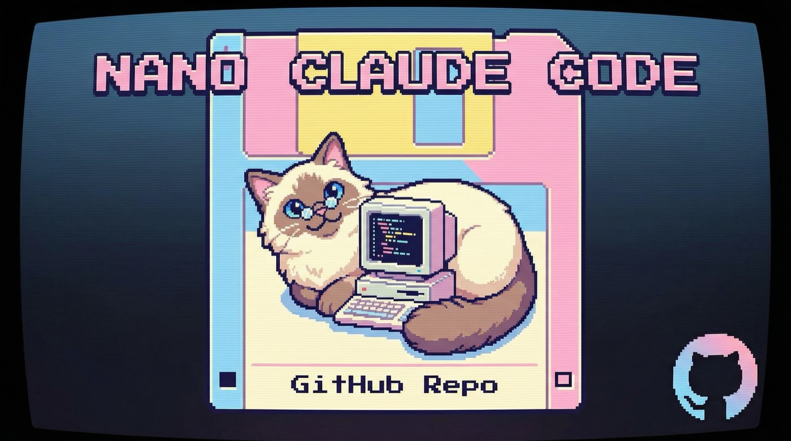
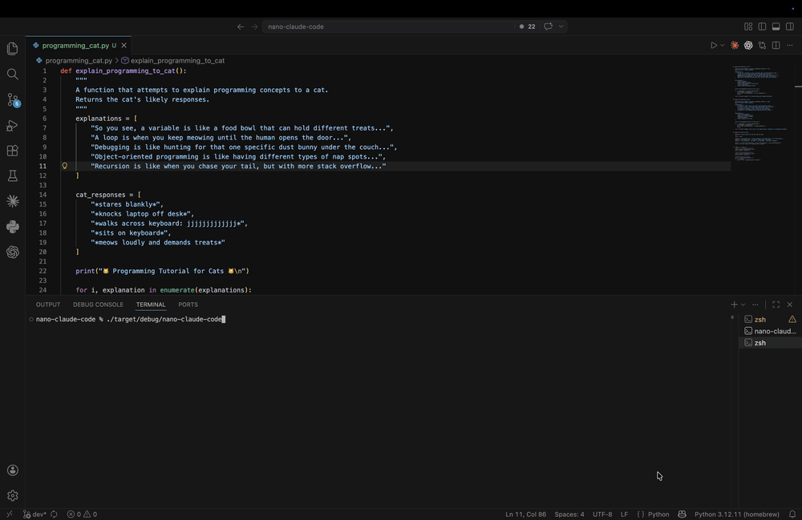

<h2 align="center">A Rust Implementation of Claude Code</h2>

<p align="center">
  <strong>Faithful migration. Same agentic architecture. Rust runtime.</strong>
</p>
<p align="center">
  
</p>

<p align="center">
  Nano-Claude-Code is a Rust implementation of Claude Code in the most faithful migration on the internet. The exact same architecture as Claude Code while moving the runtime to Rust.
</p>

<p align="center">
  <em>Not a wrapper. Not a toy. Not “inspired by”. A serious Rust implementation of Claude Code’s agentic architecture.</em>
</p>

## Why This Exists

Claude Code is one of the most compelling agentic coding products ever shipped.

This project exists because that model deserves a Rust runtime:

- lower operational overhead
- tighter control over process, memory, and IO behavior
- better foundations for long-running local agents
- a cleaner path to shipping a serious native implementation

## See It In Action

<p align="center">
  
</p>

## What “Faithful” Means Here

Nano-Claude-Code is not trying to imitate the vibe of Claude Code while replacing the internals with a different product.

It is aiming to preserve the actual shape of the system:

- agent-first interaction model
- explicit tool orchestration instead of hidden shortcuts
- persistent sessions and resumability
- sub-agent lifecycle and delegation semantics
- MCP/tool routing
- terminal execution, file operations, and workspace-aware behavior
- live provider integration instead of a fake local-only shell

The migration standard is simple: keep the observable behavior and the agentic architecture aligned with the frozen TypeScript source, then re-express it cleanly in Rust.

## Project Status

This repository is an active Rust build of Nano-Claude-Code, not a marketing mockup.

Current public branch highlights:

- Rust CLI and runtime
- session persistence and resume flow
- live provider/module surface
- bash/task, file/workspace, permissions, MCP, and agent modules
- demo smoke script

Private development continues with a stricter migration harness and internal migration notes.

## Benchmarks

The point of this project is not just parity. It is parity with a substantially leaner runtime profile.

Public, apples-to-apples benchmark numbers against the TypeScript baseline are still being finalized. The project is being developed with aggressive efficiency goals, and benchmark publishing is planned as part of the migration work rather than treated as an afterthought.

Until that benchmark suite is published, this README intentionally avoids inventing exact percentage claims.

## Quick Start

```bash
cargo build
./target/debug/nano-claude-code
```

To run with a live Anthropic key:

```bash
export ANTHROPIC_API_KEY=your_key_here
./target/debug/nano-claude-code
```

Or run the demo smoke path:

```bash
./scripts/demo-smoke.sh
```

## Why It Could Matter

If this works, the outcome is bigger than “a Rust rewrite”.

It means:

- a real Rust-native Claude Code implementation
- the same agentic product model with less runtime drag
- a credible path to better local performance and long-session stability
- a cleaner foundation for serious autonomous coding workflows

## Philosophy

There are plenty of projects that copy the interface and lose the architecture.

This one is trying to do the opposite:

> keep the architecture, keep the behavior, keep the agent,
> then make the runtime worthy of it.

## Follow The Build

If you care about:

- Rust
- agentic coding systems
- terminal-native developer tools
- faithful systems migration
- Claude Code style orchestration

then watch this repo.

The interesting part is not that it is in Rust.

The interesting part is that it is trying to carry the exact agentic architecture over without blinking.

## To get in touch with the author, Sahibzada Allahyar:

- X: https://x.com/singularity_sah
- LinkedIn: https://www.linkedin.com/in/sahibal/
